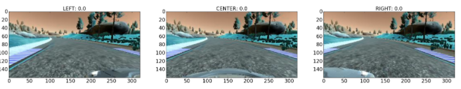
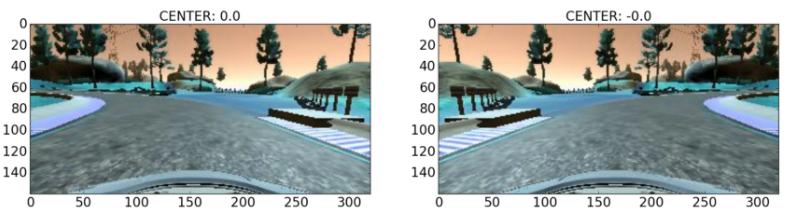
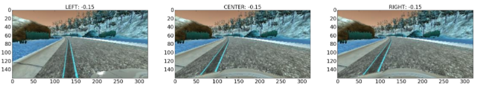
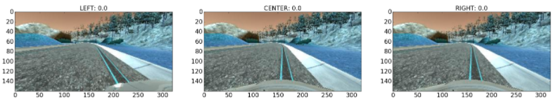
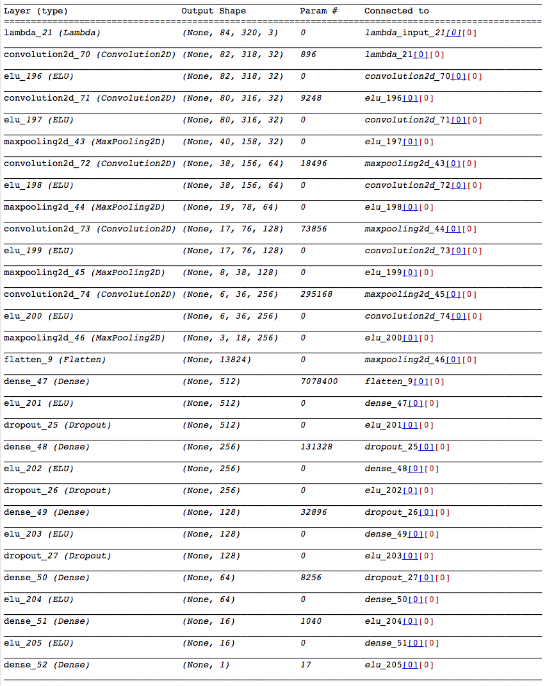

# Project 3: Behavioral Cloning

---
The aim of this project was to train a deep learning model that can teach a car of how to drive around a track in a udacity developed simulator. The data used to train this model is generated using the udacity simulator.

### Files

* model.py: Python script that imports data, preprocesses data, trains model and saves model
* model.json: Contains Model Architecture
* model.h5: contains model weights
* drive.py: A modified python scipt that is used to drive in udacity simulator using the trained model and a given dataset
* model_experiments.ipynb: Overview of various experiemnts tried to get a working pipeline

### DataSet

* I collected two datasets using udacity simulator. One data set was collected using mouse and other was collected using arrows
* I also utilized dataset provided by udacity 
* I also learned through various experiemnts that only using data that has straight driving and waring off the road was not sufficient to get a successful training model. The training data also need flavour of recovery samples whereby the car recovers when it goes off the track ( crosses the yellow border or red markers on turns). Thanks to Pkern, I utilized his recovery data set only along with the above mentioned dataset.

### Method utilized for final pipeline

#### Preprocessing data 

* Data engineering was by far the most important part of this assignment. 
* I started with using the cropped images as advised in the class but that didn't get me to a working model
* I utilized udacity dataset which was displined driving in the center of the lane. This dataset was far away from real word scanerio whereby there might be times when car crosses the yellow shoulder line. Example of center lane driving shown below:

 
* I introduced flipped images which immitated right turns on the circuit. This was required as most of the data collected represented left turns. This enabled us to get more balanced dataset. Example image flipping shown below:

* I also added more samples of left and right turns so that I can get a balanced dataset which immitates left, right and straight driving. 

* I utilized recovery data recorded by pkern which moves the car from left to center of lane and right to center of lane. Example shown below:

Thanks to blog post written by Vivek Yadav, Denise James, https://blog.keras.io/building-powerful-image-classification-models-using-very-little-data.html, it provided sufficient guidance to move further whenever I was stuck with a problem

### Model Architecture

* I tried different model Architecture
* A subset of Nvidia Behavior cloning model used by them in the paper
* A modified version of vgg_net()
* A Convolutional Neural Network (model_cnn) model that I came up with 

All this models ran successfully around the the circuit thanks to the enormous amount of time spent on data engineering. I finally ended up using the CNN model that I came up with as it had less parameters to tune. 

Below is the model used:

#### Hyper parameters

Below are the hyper parameters used for training the model 

* l2_reg = 0.001
* keep_prob = 0.5
* batch_size = 64
* min_delta=1e-4
* patience=4
* nb_epoch = 100
* beta2 = 0.999
* beta1 = 0.9
* epsilon = 1e-08
* decay = 0.01
* lr = 0.001

* I also used keras's call back functions so that the training can be killed is not further improvements is added. To do so a patience factor of 4 with a minimum improvement parameter of 0.0001. 

### Results

* The video of the results can be found ](https://www.youtube.com/watch?v=68uVkE1-1-Q)

 The results attained was tested on a different dataset that I collected which was not used in training or validation.

### Discussion 

* It was by far a great learning experience on this project. 
* Something that I learned while working on this project is that: One can get a Deep Learning model working provided they have representative data (even if its less) and its better to spend time on data engineering.
